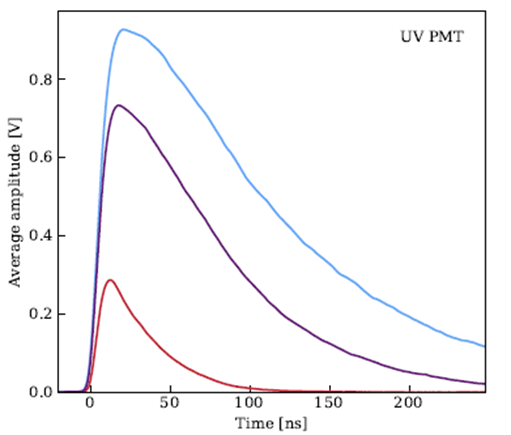

# 新学期报告 
大家好，我现在要介绍的是一种用于高强度束流探测的气氙闪烁体探测器。
 首先我们来看一下气氙用于闪烁体材料的一些优势以及为什么我们需要搭建这个探测器
 首先，氙的原子序数和密度都是比一般的闪烁体要高的，这代表着它在核反应中有着更高的反应截面，探测效率也就更高。然后，气氙用于闪烁体的一个重要的原因就是它的短的衰减时间
    大家知道，闪烁体是依靠闪烁体退激发光在通过pmt来记录一次信号，所以衰减时间很大程度决定了探测器的时间分辨能力。二这在我们实验中是非常重要的。上周提到了CCCS的实验是要测束流的能量吗，但是束流是在很短的时间内出现打出很多粒子，如果探测器的时间分辨不够，就可能会把多个粒子的信号当成一个进行计算，这种信号称为pile up信号。我本科毕设就这种信号在实验上一般通过电子学标记然后在数据分析中一般是要舍去的，但这种方法就可能会损失很多的有效事件，让我们的事件数不够。包括之后HIAF束流更大的话，这个更高分辨的探测器就很重要。然后另一点就是氙的量子产额相对是比较高的，比塑闪要高，可能会低于一些无机闪烁体，然后量子产额就决定了探测器的能量分辨率嘛，同一个事件，你产生的光子越多能量分辨率就越好

    然后就我们探测器的一些研究背景吧。就之前在日本已经研发过一个类似的气氙探测器，可以看到这个结构就是里面是腔体里装了氙，然后四周有四个PMT去收集光子，然后这个有几个问题，首先是zhe